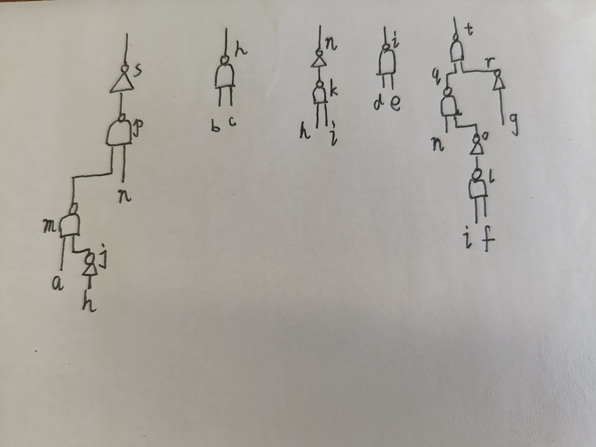
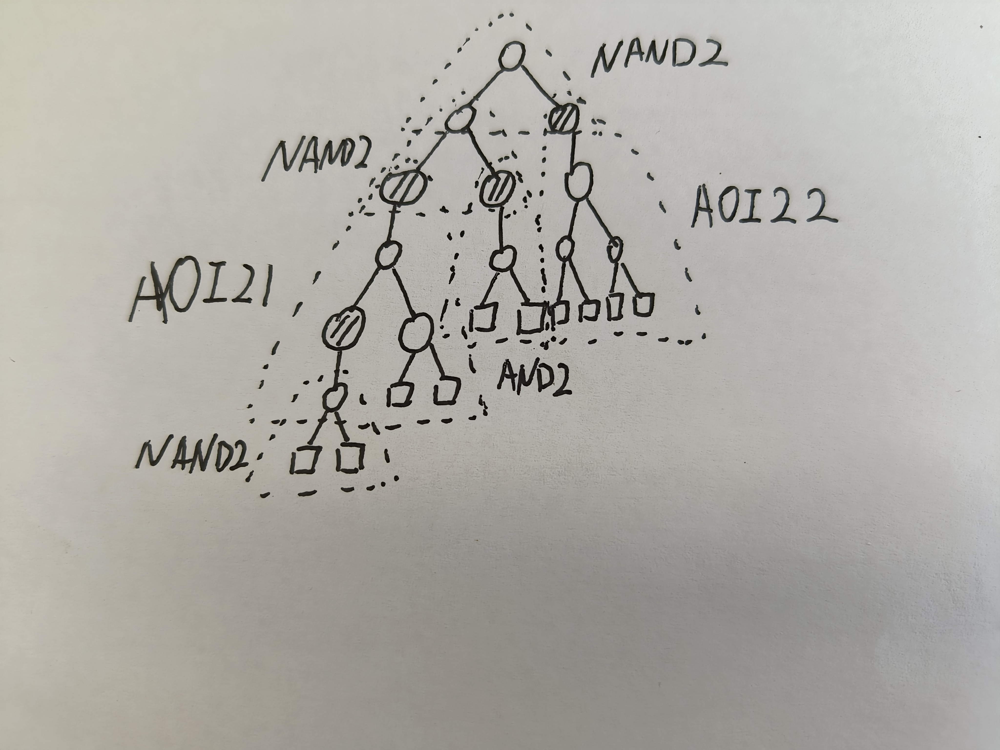

# Written Assignment One

## 1
a),b),c)
## 2

## 3
Node 13 :    {NAND2}
Node 6  :    {NAND2, OR2}
Node 12 :    {NOT,AND2,AOI22}
Node 5  :    {NOT,AND2,AOI21}
Node 8  :    {NOT,AND2}
Node 11 :    {NAND2}
Node 4  :    {NAND2}
Node 7  :    {NAND2}
Node 9  :    {NAND2}
Node 10 :    {NAND2}
Node 2  :    {NOT,AND2}
Node 3  :    {NAND2}
Node 1  :    {NAND2}

Min(N1)  =   3
Min(N3)  =   3
Min(N2)  =   Min(2+Min(N1),4) = 4
Min(N10) =   3
Min(N9)  =   3
Min(N7)  =   3
Min(N4)  =   3+Min(N2)+Min(N3) = 10
Min(N11) =   3+Min(N9)+Min(N10) = 9
Min(N8)  =   Min(2+Min(N7),4) = 4
Min(N5)  =   Min(2+Min(N4),4+Min(N2)+Min(N3),7+Min(N1)) = 10
Min(N12) =   Min(2+Min(N11),4+Min(N9)+min(N10),7) = 7
Min(N6)  =   Min(3+Min(N5)+Min(N8),5+Min(N4)+Min(N7)) = 17
Min(N13) =   3+Min(N6)+Min(N12) = 27

                                NAND2
                    NAND2                   AOI22
            AOI21           AND2           Input*4
      Input*2   NAND2      Input*2
               Input*2
    

The minimum cost value is 27.

## 4

a),d)

## 5

### a

1+3=4,
1+1=2,
2+3=5,
3+2=5.

So 4+2+5+5 = 16.

### b

Net B and Net D.

(2+3)-2+(1+2)-5 = 1

### c

$e^{\frac{-1}{10}} \approx 0.905$

## 6

c),d),e)