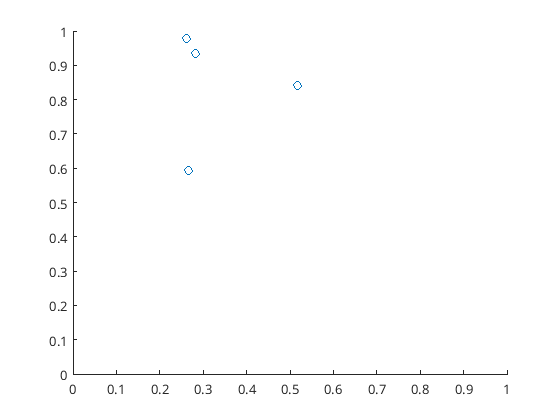
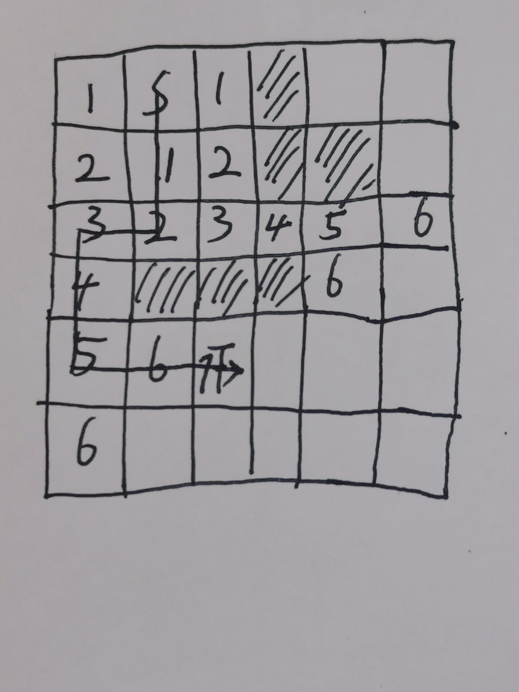
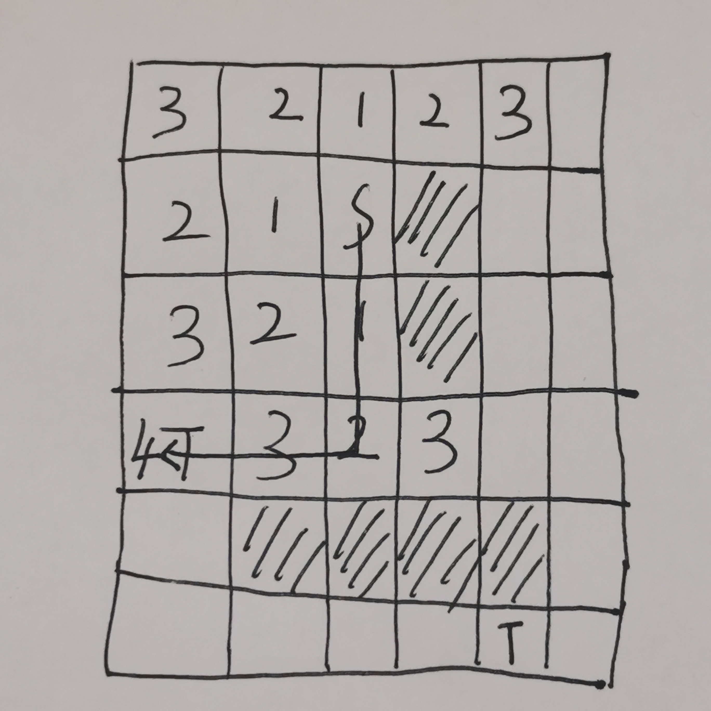
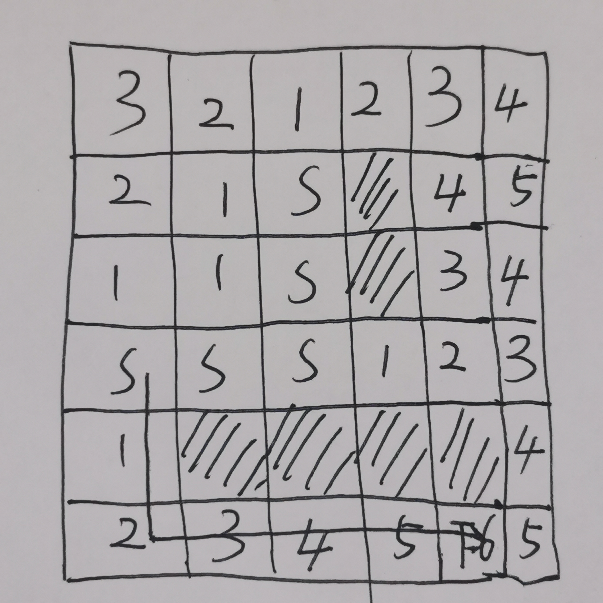
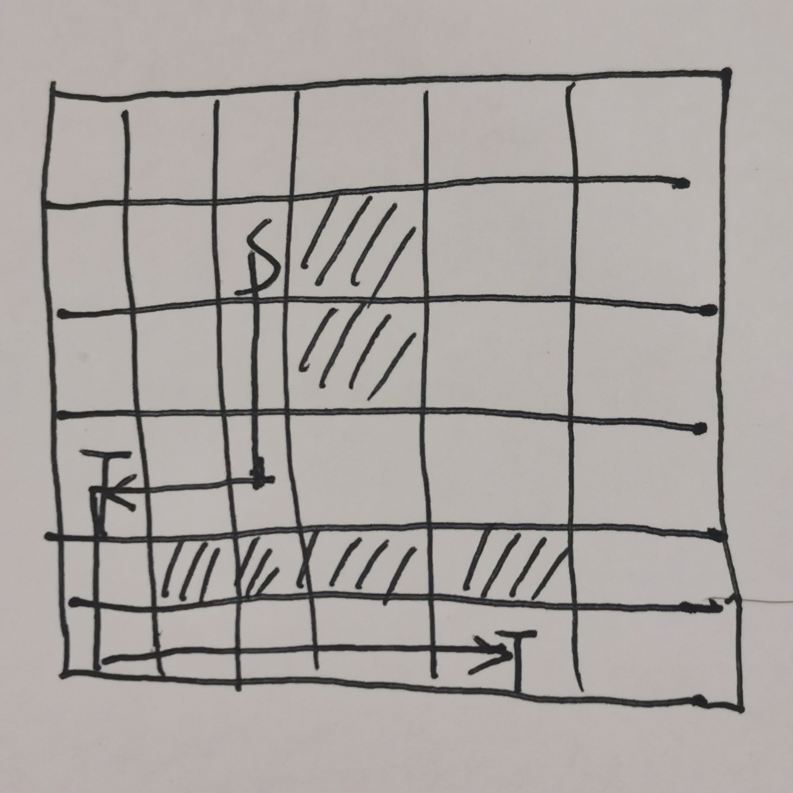
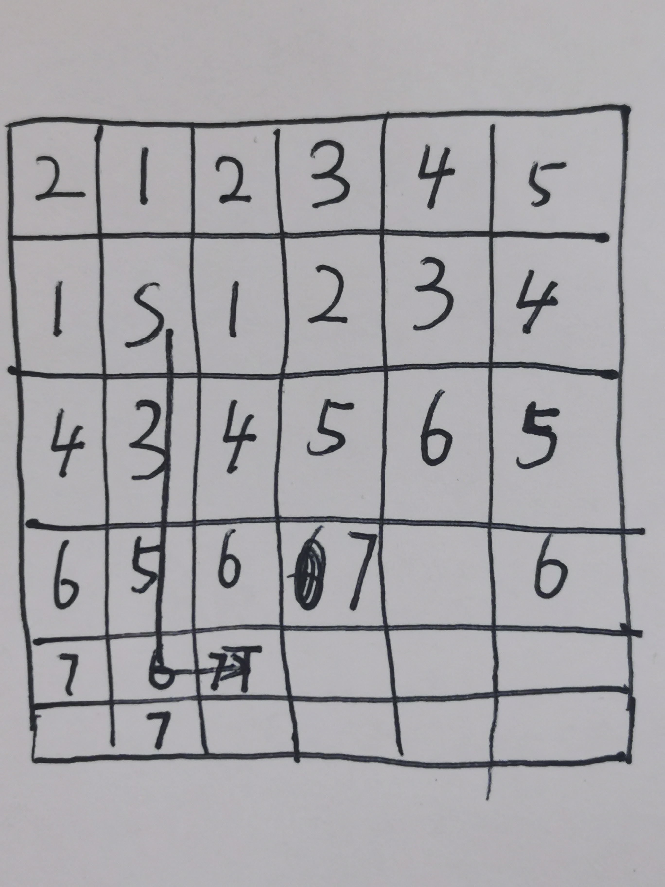

# Assignment 2

## 1

- Net A: $\frac{1}{2}((1)^2 + (2)^2)+\frac{1}{2}((1)^2 + (3)^2) + \frac{1}{2}((1)^2 + (0)^2) = \frac{5}{2} + \frac{10}{2} + \frac{1}{2} = 8$
- Net B: $1+1 = 2$
- Net C: $2^2+3^2 = 13$
- Net D: $\frac{1}{2}(1)+\frac{1}{2}(10) + \frac{1}{2}(13) = 12$

So $8+2+13+12 = 35$

## 2

### a)

$C = \left[\begin{matrix}
    0&1&1&0\\
    1&0&1&0\\
    1&1&0&10\\
    0&0&10&0
\end{matrix}\right]$

So $A=\left[\begin{matrix}
    3&-1&-1&0\\
    -1&3&-1&0\\
    -1&-1&12&-10\\
    0&0&-10&30
\end{matrix}\right]$

### b)

$b_X = \left[\begin{matrix}
    1 \times 1\\
    0 \times 1\\
    0\\
    20 \times 0.25
\end{matrix}\right] =
\left[\begin{matrix}
    1 \\
    0 \\
    0\\
    5
\end{matrix}\right]$

$b_Y = \left[\begin{matrix}
    1 \times 1\\
    0 \times 1\\
    0\\
    20 \times 1
\end{matrix}\right] =
\left[\begin{matrix}
    1 \\
    0\\
    0\\
    20
\end{matrix}\right]$

### c)

$AX=b_x,AY=b_Y$

Then we can get 
$X = \left[
    \begin{matrix}
    \\
    \frac{95}{184} \\
    \\
    \frac{49}{184} \\
    \\
    \frac{13}{46} \\
    \\
    \frac{6}{23} \\
    \\
    \end{matrix}
\right]$
$Y = \left[
    \begin{matrix}
    \\
    \frac{155}{184} \\
    \\
    \frac{109}{184} \\
    \\
    \frac{43}{46} \\
    \\
    \frac{45}{46} \\
    \\
    \end{matrix}
\right]$

### d)

Left: 4,2
Right: 3,1

So gate 2 and gate 4 are at assigned to the left.
The pad at (0,0) and (0.25,1) will still be on the left part.

gate 1 and gate 3 will be propagated to the vertical cutline as pseudo-pads.

The pad at (1,1) will not be propagated to the vertical cutline as pseudo-pad because there is no connection between the pad and gate 2 or gate 4.

## 3

c) and d)

## 4

The pathcost is 7.

## 5

Find the first T.

Set the path as S and find another T.

The final path is:

The pathcost is 10.

## 6

$15 \leq  3+ 2K$

So $K \geq 6$.

If $K=6$, the pathcost of using non-unit-cost cells and the pathcost of not using non-unit-cost cells is the same.

So it will not make sure that the final route will only use unit cost cells.

So the minimum value of K is 7 when the path through the unit-cost cells will be cheaper than the path through the non-unit-cost cells.

## 7

The pathcost is 7.

