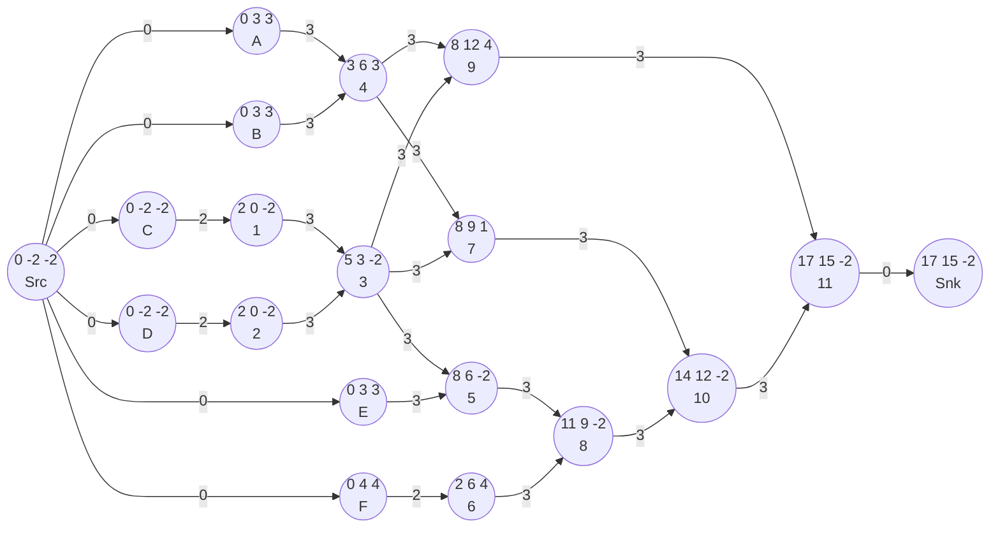
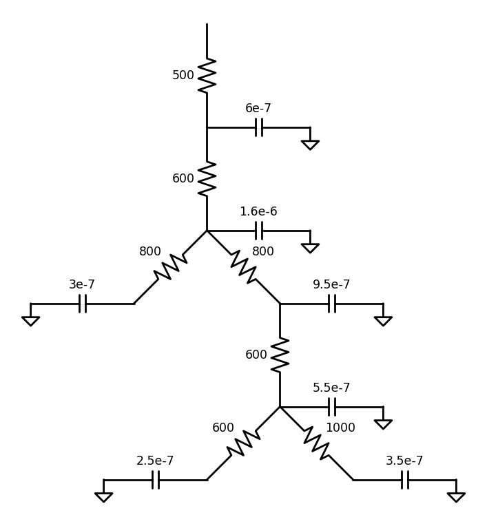

# Written Assignment Three

## 1

a),e),f)

## 2

There is a timing violation because the worst slack is -2.

The longest path is 
Src-C-1-3-5-8-10-11-Snk and Src-D-2-3-5-8-10-11-Snk.

## 3
a),c)

## 4
### a
$R_{a-1} = \frac{0.5 \times 1200}{1} = 600 $
$R_{1-b} = \frac{0.5 \times 800}{0.5} = 800 $
$R_{1-2} = \frac{0.5 \times 1600}{1} = 800 $
$R_{2-3} = \frac{0.5 \times 600}{0.5} = 600 $
$R_{3-c} = \frac{0.5 \times 600}{0.5} = 600 $
$R_{3-d} = \frac{0.5 \times 1000}{0.5} = 1000 $
$C_{a-1} = 1 \times 10^{-9} \times 1200 \times 1 = 1.2\times 10^{-6}$ 
$C_{1-b} = 1 \times 10^{-9} \times 800 \times 0.5 = 4\times 10^{-7}$ 
$C_{1-2} = 1 \times 10^{-9} \times 1600 \times 1 = 1.6\times 10^{-6}$ 
$C_{2-3} = 1 \times 10^{-9} \times 600 \times 0.5 = 3\times 10^{-7}$
$C_{3-c} = 1 \times 10^{-9} \times 600 \times 0.5 = 3\times 10^{-7}$ 
$C_{3-d} = 1 \times 10^{-9} \times 1000 \times 0.5 = 5\times 10^{-7}$  

### b
$\tau_{a} = 500 \times (4.6\times 10^{-6}) = 0.0023 $
$\tau_{a-1} = \tau_{a}  + 600 \times (4\times 10^{-6}) = 0.0047 $
$\tau_{a-b} = \tau_{a-1} + 800 \times (3 \times 10^{-7}) = 0.00494 $
$\tau_{a-2} = \tau_{a-1} + 800 \times (2.1 \times 10^{-6}) =0.0047+0.00168=0.00638 $
$\tau_{a-3} = \tau_{a-2} + 600 \times (1.15 \times 10^{-6}) = 0.00707 $
$\tau_{a-c} = \tau_{a-3} + 600 \times (2.5 \times 10^{-7}) = 0.00707+0.00015= 0.00722$
$\tau_{a-d} = \tau_{a-3} + 1000 \times (3.5 \times 10^{-7}) = 0.00707+0.00035= 0.00742$

So $\tau_{a-b} = 0.00494 ,\tau_{a-c} =0.00722,\tau_{a-d}=0.00742$

